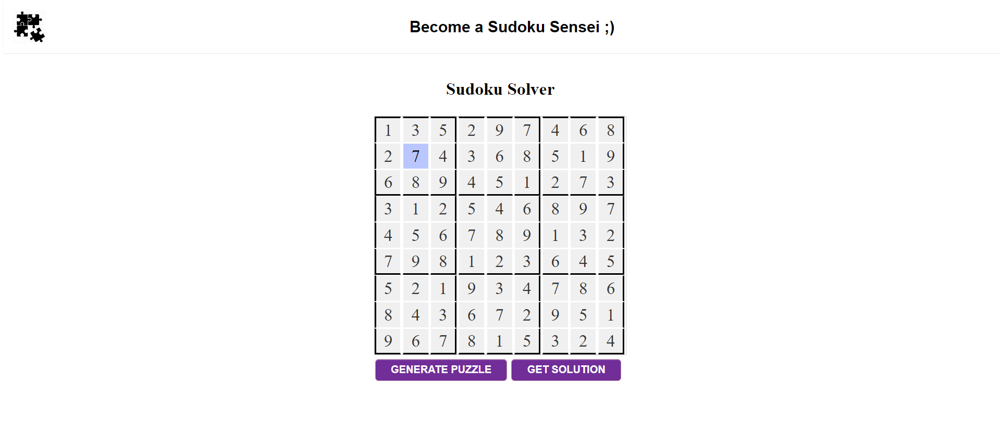

# Sudoku-Solver 

This is a web-based Sudoku Solver that allows users to generate a random Sudoku puzzle and get the solution for it. The project consists of three main files: `index.html`, `styles.css`, and `script.js`. The goal of this project is to help users solve Sudoku puzzles and practice solving them.

 <!-- Replace this with the actual image link -->

## Features

- **Generate Random Puzzle**: Users can generate a new random Sudoku puzzle.
- **Get Solution**: Users can solve the puzzle by clicking the "Get Solution" button, which displays the correct solution.
- **Interactive Interface**: The interface includes a clean and simple design for ease of use.

## Technologies Used

- **HTML5**: Structure of the web page.
- **CSS**: Styling for the interface.
- **JavaScript**: Logic for generating and solving Sudoku puzzles.

## File Structure

- `index.html`: The main HTML file that contains the layout of the webpage.
- `styles.css`: The CSS file that styles the page.
- `script.js`: The JavaScript file that includes the logic for generating random Sudoku puzzles and solving them.

## How to Run the Project

1. Clone the repository:
   ```bash
   git clone https://github.com/your-username/sudoku-solver.git
2. Navigate to the project directory:
   ```bash
   cd sudoku-solver
3. Open index.html in your web browser:
   ```bash
   open index.html
